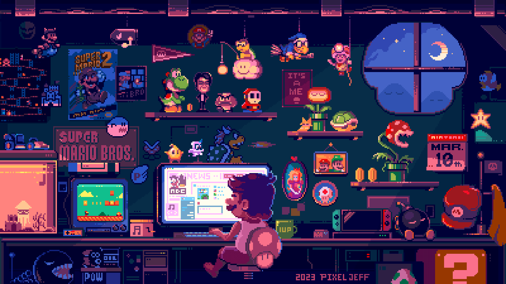

  

###

<h1 align="center"><samp>Hi  ,  >LOL!</samp></h1>

<h3><samp></samp></h3>

###

<h3 align="center"><samp>Connect</samp></h3>
<table align="center">
  <tr>
    <td align="center" width="100">
      
    </td>
    <td align="center" width="100">
      
    </td>
    <td align="center" width="100">
      
    </td>
  </tr>
</table>
  

